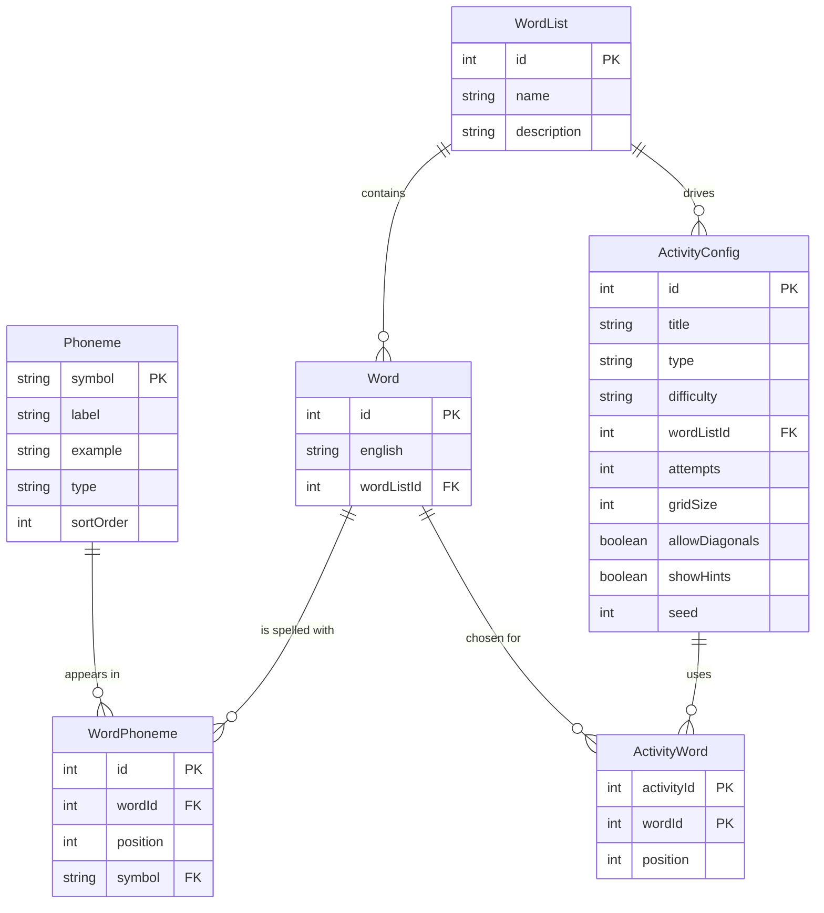

# Phoneme Activity Builder

**Assessment 2: Backend Implementation and Database Integration**
Reed Stelfox · Student No. 22813726 · CSE3CWA

A Next.js application that lets Speech Pathology teachers build phoneme-based
**Wordle** and **Word Search** classroom activities, store their word lists
and activity settings in a database, and generate each activity as a single
playable `.html` file that runs in any web browser.

Assessment 1 built the frontend. Assessment 2 adds the backend: a Prisma
schema on SQLite, a validated REST API with full create, read, update and
delete (CRUD), server-side HTML generation from stored data, a `/health`
endpoint, and a Docker image. The project was created with
`npx create-next-app .` and extended from there.

---

## Quick start (local)

Requires Node.js 22 or newer.

```bash
npm install        # also runs "prisma generate"
npm run setup      # creates the SQLite database, applies migrations, seeds data
npm run dev        # http://localhost:3000
```

`npm run db:seed` resets the data to the seeded state at any time, and
`npm run db:studio` opens Prisma Studio to browse the tables.

## Run with Docker

```bash
docker compose up --build
```

Then open http://localhost:3000 and check http://localhost:3000/health.

Without Compose:

```bash
docker build -t phoneme-activity-builder .
docker run -p 3000:3000 -v phoneme-data:/app/data phoneme-activity-builder
```

On start-up the container applies any pending migrations, seeds a brand-new
database with the course word lists, then starts the server. The database
file lives in the `phoneme-data` volume, so saved work survives restarts and
rebuilds. `docker compose down -v` deletes the volume for a clean start.

The image is a three-stage build (dependencies, build, runtime) based on the
official Next.js Docker example. It uses Next.js standalone output, runs as a
non-root user, and includes a `HEALTHCHECK` that calls `/health`.

## Pages

| Route         | Purpose                                                                        |
| ------------- | ------------------------------------------------------------------------------ |
| `/`           | Home: introduction and links to the tools                                      |
| `/word-lists` | Create, rename and delete word lists; add, edit, delete and bulk-import words |
| `/wordle`     | Build, save, load and delete Wordle activities; generate the HTML file         |
| `/wordsearch` | Build, save, load and delete Word Search activities; generate the HTML file    |
| `/about`      | Project explanation, author details and the how-to-use video                  |
| `/settings`   | Light, dark or system theme and layout density, stored in cookies             |

## API reference

Every error response has the same shape, so the interface can show a headline
and the specific problems:

```json
{ "error": "Unknown phoneme symbol(s)", "details": ["\"rat\": \"r\" is not an HCE phoneme. Did you mean /ɹ/ (as in ring)?"] }
```

| Method   | Path                                 | Purpose                                                         |
| -------- | ------------------------------------ | --------------------------------------------------------------- |
| `GET`    | `/health`                            | 200 OK when the server and database are up, 503 otherwise       |
| `GET`    | `/api/phonemes`                      | The 43-symbol HCE phoneme inventory                             |
| `GET`    | `/api/word-lists`                    | All word lists with word and activity counts                    |
| `POST`   | `/api/word-lists`                    | Create a list, optionally with initial words                    |
| `GET`    | `/api/word-lists/:id`                | One list with all of its words and phonemes                     |
| `PATCH`  | `/api/word-lists/:id`                | Rename a list or change its description                         |
| `DELETE` | `/api/word-lists/:id`                | Delete a list, its words and the activities that use it         |
| `POST`   | `/api/word-lists/:id/words`          | Add one word, or bulk import `{ "words": [...] }` all-or-nothing |
| `GET`    | `/api/words/:id`                     | One word                                                        |
| `PATCH`  | `/api/words/:id`                     | Change a word's spelling and/or replace its phonemes            |
| `DELETE` | `/api/words/:id`                     | Delete a word (it is also removed from any activity)            |
| `GET`    | `/api/activities?type=WORDLE`        | Saved activities, optionally filtered by type                   |
| `POST`   | `/api/activities`                    | Save a new Wordle or Word Search configuration                  |
| `GET`    | `/api/activities/:id`                | One saved activity with its words                               |
| `PATCH`  | `/api/activities/:id`                | Update any settings or the chosen words                         |
| `DELETE` | `/api/activities/:id`                | Delete a saved activity                                         |
| `GET`    | `/api/activities/:id/generate`       | Build the playable HTML file from the database (download)       |

Status codes: `200` read or update, `201` created, `400` invalid input,
`404` not found, `409` duplicate spelling, `500` unexpected server error
(logged, with a generic message to the client), `503` database unavailable.

## Database schema



- **Phoneme** is the reference inventory (43 HCE symbols). It holds the
  English letter hint and example word, so hover hints such as
  `/θ/: TH (as in thin)` come from the database.
- **WordPhoneme** stores one phoneme per row with its position. This is how
  the schema handles symbols longer than one character (`tʃ`, `dʒ`, `æɪ`,
  `əʉ`): each one is a single value with its own identity, and its foreign
  key to `Phoneme` means the database itself rejects unknown symbols.
- **Word** has a unique `(wordListId, english)` constraint, so a spelling
  cannot appear twice in one list.
- **ActivityConfig** stores a saved activity: type, difficulty label, hint
  setting and the output settings (guesses, grid size, diagonals, layout seed).
- **ActivityWord** is a join table recording which words an activity uses and
  in what order, so one list can drive many activities.
- Deleting a list cascades to its words and activities; deleting a word
  removes it from any activity that used it.

Two migrations are included. The second shows schema evolution: it replaced a
single `targetWordId` column with the `ActivityWord` join table and copies any
existing target words across before the old column is dropped.

## Validation and error handling

Validation happens on both sides, and the server is the authority.

1. **Shape** (zod, `lib/validation.ts`): types, required fields, lengths,
   ranges (3 to 8 guesses, 6 to 14 grid) and allowed values.
2. **Clean-up** (`lib/phoneme-normalize.ts`): typographic variants of the same
   symbol are normalised, for example the IPA script ɡ to g, a typed colon to
   the length mark ː, and the ʧ and ʤ ligatures to tʃ and dʒ.
3. **Database rules** (`lib/word-rules.ts`, `lib/activities.ts`): every
   phoneme must exist in the inventory table; spellings are unique per list;
   chosen words must exist and belong to the chosen list; a Wordle needs 1 to
   10 words of at least two phonemes; a Word Search needs 3 to 12 words that
   fit the grid.
4. **Friendly messages**: an unknown symbol gets a suggestion, such as
   `"r" is not an HCE phoneme. Did you mean /ɹ/ (as in ring)?`, and bulk
   import errors are numbered by word.
5. **Graceful failure**: malformed JSON, bad ids, missing records and words
   deleted after an activity was saved all return a clear 4xx message instead
   of a crash. Unexpected errors are logged and return a generic 500.

In the browser the phoneme keyboard can only produce valid symbols, and the
bulk import previews problems line by line before anything is sent.

## Testing

With the dev server (or the Docker container) running:

```bash
npm run test:api
```

`scripts/api-smoke-test.ts` makes over 50 checks against the live API: health,
every CRUD route, phoneme normalisation, each validation rule, bulk import
atomicity, activity rules, HTML generation from stored data, and cascade
deletes. It creates its own list and removes it afterwards. Point it at
another server with `BASE_URL=http://host:port npm run test:api`.

## Project structure

```
app/
  api/                  REST API route handlers (word lists, words, activities, phonemes)
  health/route.ts       GET /health
  word-lists/ wordle/ wordsearch/ about/ settings/   Pages
components/
  wordlists/            Word list manager: sidebar, header, word editor, table, bulk import
  activities/           Shared builder pieces: useActivityBuilder hook, word picker,
                        difficulty picker, saved activities, save and generate panel
  wordle/ wordsearch/   Builders and playable previews
  phonemes/             Phoneme key, keyboard, builder and chips
  layout/ ui/           Header, navigation, footer, cards, alerts, buttons
lib/
  db.ts                 Prisma client singleton
  api.ts                Route helpers: JSON envelopes, error mapping, body parsing
  validation.ts         zod schemas
  word-rules.ts         Phoneme and spelling rules that need the database
  activities.ts         Activity serializer and word selection rules
  phoneme-normalize.ts  Normalisation, suggestions, tokeniser, bulk parser
  client-api.ts         Typed fetch helpers used by the pages
  generate/             Standalone HTML builders (Wordle, Word Search)
  phonemes.ts words.ts  HCE inventory and corpus (seed data)
prisma/
  schema.prisma         Data model
  migrations/           Versioned SQL migrations
  seed.ts               Seeds the inventory, corpus lists and example activities
scripts/
  api-smoke-test.ts     End-to-end API checks
Dockerfile  docker-compose.yml  docker-entrypoint.sh
```

## The how-to-use video

The walkthrough video is embedded on the About page and loads from
`public/how-to-use.mp4`. **It is included in the submitted zip file but is
deliberately excluded from this public repository**, because the video shows
my student identification card as the brief requires, and identity documents
should not be published on a public site.

## Design justification

**Architecture.** The backend lives inside the same Next.js project as the
frontend, as route handlers under `app/api` (Vercel, n.d.). One codebase, one
build and one container kept the project simple to run and to mark, while
still separating concerns: pages never touch the database, they call a REST
API that follows Fielding's (2000) constraints of stateless requests and
resources identified by URLs. Each route is a thin layer that validates
input, calls shared logic in `lib/`, and returns a consistent JSON envelope.
Business rules (which words suit which activity, what makes a phoneme valid)
live in plain modules that are independent of HTTP, so they can be unit
tested in the next assessment and reused by the generator.

**Database design.** The schema is relational and normalised (Codd, 1970). The
central decision was how to store phonemes. The brief warns that phonemes can
take more than one character. Storing a word as the string "tʃɪn" would make
it impossible to know where one phoneme ends and the next begins, and storing
a comma-separated or JSON array would push integrity checks into application
code. Instead each phoneme is a row in `WordPhoneme`, with a position and a
foreign key into the `Phoneme` inventory. Multi-character HCE symbols
(Harrington et al., 1997) are single values, order is explicit, and the
database refuses a symbol that is not in the inventory. The inventory row also
holds the English letter hint, so the hints students see come from one place.
The same thinking produced the `ActivityWord` join table: an activity refers
to words rather than copying them, so fixing a transcription in the word list
fixes every activity that uses it. Constraints are pushed into the database
where possible: a unique spelling per list, a unique position per word, and
cascading deletes so no orphaned rows remain.

**ORM and migrations.** Prisma gives a typed client generated from the schema,
so a renamed column becomes a compile error rather than a runtime surprise,
and it produces versioned SQL migrations (Prisma Data, n.d.). The second
migration changed an existing column into a join table. Rather than accept
data loss, I edited the generated SQL to copy each existing Wordle target into
the new table before the old column was dropped, which is the kind of change a
real deployment has to survive.

**Validation and error handling.** Input is treated as untrusted and validated
on the server before anything is stored, using an allow-list of known
phonemes rather than a block-list of bad characters, as the OWASP Foundation
(n.d.) recommends. Validation is layered: zod checks shape and ranges, a
normalisation step accepts harmless typographic variants, and database-backed
rules check references and business logic. The messages follow Nielsen's
(1994) heuristic of helping users recognise, diagnose and recover from errors.
A teacher who types "r" is told that HCE writes the sound as ɹ, with an
example word, rather than receiving "invalid input". Bulk imports are
all-or-nothing inside a transaction, so a single bad line never leaves a list
half-imported. Unexpected errors are logged on the server and return a
generic message, so internal details are not leaked to the browser.

**Generation from stored data.** In Assessment 1 the browser built the HTML
from temporary form values. Now the Generate button saves the activity first
and the server builds the file from the database. The file therefore always
matches what is stored, and a word edited or deleted after saving is caught:
the activity rules run again at generation time and explain what needs
fixing. The Word Search layout is produced by a seeded generator, and the seed
is stored, so the downloaded puzzle is exactly the one previewed. Word lists
now drive the output: a Wordle can hold several words that students play in
order, and a Word Search can use any list.

**Docker.** Containers make the environment reproducible, so the app behaves
the same on a marker's machine as on mine (Merkel, 2014). The Dockerfile uses
a multi-stage build (Docker Inc., n.d.): dependencies and the build tool chain
stay in earlier stages, and the runtime image contains only the standalone
server, the Prisma client and the migrations. The container runs as a
non-root user, applies migrations on start-up, seeds only an empty database so
a teacher's data is never overwritten, keeps the database in a volume, and
reports its health through the `/health` endpoint.

**Trade-offs.** SQLite was chosen over PostgreSQL because it needs no separate
server, which keeps the app in a single container and simple to run for
marking; the cost is limited write concurrency, which suits one teacher's
workload. Prisma's schema file makes the SQLite to PostgreSQL move a small
change if the app is later deployed for many users. Keeping the API inside
Next.js avoids a second service but ties the backend to the framework, a
reasonable choice at this scale. Storing the difficulty as a label while
saving the concrete settings lets teachers fine-tune, at the cost of a label
that can drift from its preset.

**Supporting Speech Pathology teaching.** Teachers can now build their own
lists for the sounds a class is working on, keep and reuse activities, and
trust that phoneme transcriptions are checked against the HCE inventory used
in their course. Students still receive a simple file that runs offline, with
the phoneme-to-English hints reinforced on every key and every answer.

## References

Codd, E. F. (1970). A relational model of data for large shared data banks.
*Communications of the ACM, 13*(6), 377-387. https://doi.org/10.1145/362384.362685

Docker Inc. (n.d.). *Multi-stage builds*. Docker Docs. Retrieved September 11,
2026, from https://docs.docker.com/build/building/multi-stage/

Fielding, R. T. (2000). *Architectural styles and the design of network-based
software architectures* [Doctoral dissertation, University of California,
Irvine]. https://ics.uci.edu/~fielding/pubs/dissertation/top.htm

Harrington, J., Cox, F., & Evans, Z. (1997). An acoustic phonetic study of
broad, general, and cultivated Australian English vowels. *Australian Journal
of Linguistics, 17*(2), 155-184. https://doi.org/10.1080/07268609708599550

Merkel, D. (2014). Docker: Lightweight Linux containers for consistent
development and deployment. *Linux Journal, 2014*(239), Article 2.
https://dl.acm.org/doi/10.5555/2600239.2600241

Nielsen, J. (1994, April 24). *10 usability heuristics for user interface
design*. Nielsen Norman Group. https://www.nngroup.com/articles/ten-usability-heuristics/

OWASP Foundation. (n.d.). *Input validation cheat sheet*. OWASP Cheat Sheet
Series. Retrieved September 11, 2026, from
https://cheatsheetseries.owasp.org/cheatsheets/Input_Validation_Cheat_Sheet.html

Prisma Data. (n.d.). *Prisma ORM documentation*. Retrieved September 11, 2026,
from https://www.prisma.io/docs/orm

Vercel. (n.d.). *Route handlers*. Next.js Docs. Retrieved September 11, 2026,
from https://nextjs.org/docs/app/getting-started/route-handlers

## GitHub repository

https://github.com/ReedStel/phoneme-activity-builder
